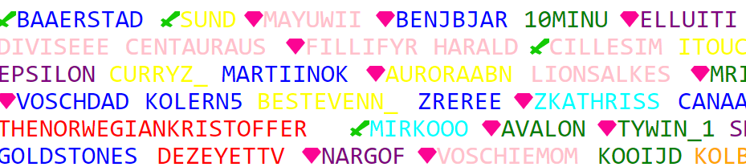

## About

A small specialized script for building a SVG from a list of twitch usernames.
Shows the names/nicknames of twitch usernames, in the color supplied and with
the role supplied. Twitch mod's get's a twitch mod sword in front of their
name. Twitch VIPS get a pink diamond in front of their name.

Made to replicate content creator [msvosch](https://www.twitch.tv/msvosch)'s t-shirt
filled with twitch chatter's who has redeemed a spot on the t-shirt.

## Usage

    python ssb [--help] | <path_to_csv_file>

Developed for Python version 3.10.6. Not tested for any other version.

## Input

### Expected CSV file format

    username,color,nickname,twitch role

### Conditions

Can't distinguish header names from content, so please remove headers from the CSV.

- Username can be any string
- (Optional) Color can be Any hex code, or named colors supported by browsers. Defaults to black.
- (Optional) Nickname can be any string. Takes precedence over username if supplioed.
- (Optional) Twitch role can be either "mod" or "vip".

## Output

### SVG file name

The svg's are named on the format

    spacey-YYYYMMDD-HHMMSS.svg

### SVG Size

The width is 1600 pixels.

The height is 34 pixels x amount of lines, where 34 pixels is the height of one line.

### Name Ordering

The svg has a set width of 1600 pixels. The script tries to prevent names overflowing the width of the svg. The script therefore checks if a name will overflow the width. If it does, it will find the first possible name that is short enough to fill the remaining width, without overflowing.

The overflowing name will then be the first to be placed on the next line.

Otherwise, the names will be in the order of the SVG.

## Possible Improvements

Possible improvements for the script:

- command line options to specify
  - other monospaced fonts
  - size of svg
  - alignment of names-> left, centre, rigth. Default behaviour is left aligned.
- Add logging/error output, so script could be used in a system.
- make a guided console user experience for non-coders
